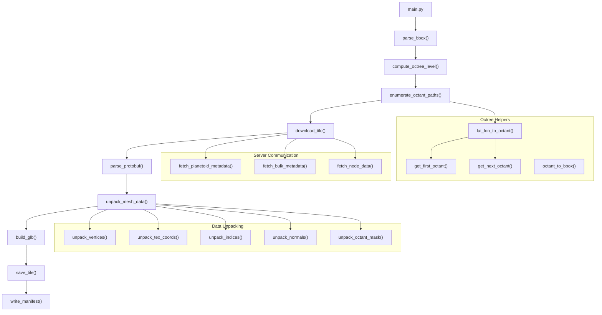

# Google Earth 3D Tile Downloader → GLB Exporter

Download 3D photogrammetry tiles from Google Earth's octree for a given lat/lon bounding box, and export them as `.glb` files with a JSON manifest.

## User Review Required

> [!IMPORTANT]
> **Texture format**: The server supports JPG (format=1) and CRN-DXT1 (format=6). JPG is simpler (no CRN decompression needed). **I plan to request JPG textures only** to avoid the CRN decompression complexity. If you need CRN-DXT1, we'd need a Python CRN decompressor library.

> [!IMPORTANT]
> **Octree level selection**: The bbox is `44.4597799,26.119593` → `44.4312648,26.1652789` (a ~3.2km × 3.8km area in Bucharest). The octree subdivides lat/lon by halving each axis. At level 17, tiles cover ~0.00054° lat × 0.00054° lon (~60m). To get roughly 8×8 = 64 tiles, we need level ~15 (tiles ~0.00219° ≈ 244m, giving about 13×21 = 273 tiles) — actually, let me calculate properly below. **I'll compute the best level dynamically** from the bbox dimensions.

> [!WARNING]
> **Rate limiting**: Google's servers may rate-limit aggressive downloads. The plan includes a configurable delay between requests and retry logic with exponential backoff.

## Open Questions

> [!IMPORTANT]
> **Coordinate system for GLB**: The raw mesh data uses `matrix_globe_from_mesh` which transforms local 8-bit mesh coordinates into ECEF (Earth-Centered Earth-Fixed) coordinates. Options:
> 1. **Keep ECEF coordinates** — tiles will be at their real-world position (thousands of km from origin). Most 3D viewers handle this fine.
> 2. **Translate to local origin** — subtract a reference point (e.g., bbox center) so coordinates are near origin. Better for game engines.
> 3. **Convert to ENU** (East-North-Up) — proper local tangent plane. Most complex but best for Bevy integration.
>
> **I plan to use option 2** (ECEF with a local offset stored in the manifest). Let me know if you prefer otherwise.

---

## Architecture Overview



---

## Proposed Changes

### Dependencies

#### [MODIFY] [pyproject.toml](file:///home/p/VIDOEGAME/crack/_data/3d_data_v2/pyproject.toml)

Add via `uv add`:
- `requests` — HTTP downloads from `kh.google.com`
- `protobuf` — parse protobuf-encoded server responses
- `pygltflib` — build and write GLB files
- `Pillow` — decode JPG textures to embed in GLB as PNG

---

### Protobuf Schema

#### [NEW] rocktree.proto

Copy the proto schema from [rocktree.proto](file:///home/p/VIDOEGAME/crack/_slop/examples/earth-reverse/v2/proto/rocktree.proto) into the project and compile it with `protoc --python_out=.` to generate `rocktree_pb2.py`.

Key message types we need:
- `PlanetoidMetadata` — root epoch for the octree
- `BulkMetadata` / `NodeMetadata` — tree structure, epochs, flags, OBBs
- `NodeData` — the actual mesh+texture data (contains `matrix_globe_from_mesh`, `meshes[]`)
- `Mesh` — vertices, texture_coords, indices, layer_and_octant_counts, texture, uv_offset_and_scale, normals
- `Texture` — raw texture bytes (JPG or CRN-DXT1)

---

### Main Script

#### [MODIFY] [main.py](file:///home/p/VIDOEGAME/crack/_data/3d_data_v2/main.py)

Complete rewrite. The main script orchestrates the pipeline:

```python
def main():
    bbox = parse_bbox("data_in/zone-bbox.txt")
    level = compute_best_level(bbox, target_grid=8)
    octant_paths = enumerate_octants_in_bbox(bbox, level)
    
    # Fetch root epoch
    planetoid = fetch_planetoid_metadata()
    root_epoch = planetoid.root_node_metadata.epoch
    
    # For each octant, walk the bulk metadata tree to verify it exists
    # and get the epoch/texture format for the NodeData request
    tiles = []
    for path in octant_paths:
        node_info = resolve_node(path, root_epoch)
        if node_info is None:
            continue
        
        # Download NodeData
        raw = download_node_data(path, node_info)
        node_data = parse_node_data(raw)
        
        # Convert to GLB
        glb_bytes = build_glb(node_data, path)
        
        # Save and collect metadata
        meta = save_tile(glb_bytes, path, node_data)
        tiles.append(meta)
    
    write_manifest(tiles, bbox, level)
```

---

### Helper Modules (all in the project root alongside main.py)

#### [NEW] octree.py — Octree coordinate helpers

Pure-math functions, no network calls.

**`parse_bbox(filepath)`** — Parse the bbox file:
```
44.4597799,26.119593    →  (lat1, lon1) = NW corner
44.4312648,26.1652789   →  (lat2, lon2) = SE corner
```
Returns `BBox(north, south, west, east)`.

**`get_first_octant(lat, lon)`** — Maps a lat/lon to the first 2-character octant path + bounding box. Earth is split into 8 quadrants at level 0:
| Octant | Region |
|--------|--------|
| `02` | S, W of -90° |
| `03` | S, -90° to 0° |
| `12` | S, 0° to 90° |
| `13` | S, E of 90° |
| `20` | N, W of -90° |
| `21` | N, -90° to 0° |
| `30` | N, 0° to 90° |
| `31` | N, E of 90° |

For Bucharest (lat 44°N, lon 26°E) → octant `30`, box `{n:90, s:0, w:0, e:90}`.

**`get_next_octant(box, lat, lon)`** — Given a bounding box, determines which sub-octant (0-7) a lat/lon falls in, returns `(digit, new_box)`. The octree is a **quad-tree on lat/lon** at each level:
- Bit 1 (value 2): lat ≥ midpoint → south half is 0, north half is 2
- Bit 0 (value 1): lon ≥ midpoint → west half is 0, east half is 1
- Bits 2 (value 4): always added for the Z-dimension variant

Note: from the reference code, at each level beyond the initial 2 digits, only bits 0-2 are used (0-7), but the lat/lon mapping only uses bits 0-1 (0-3). The "z" octant (`key+4`) covers the same lat/lon area at a different altitude. For surface tiles, we use both `key` and `key+4`.

**`compute_best_level(bbox, target_grid=8)`** — Calculates the octree level where the bbox spans approximately `target_grid` tiles. At level `L`, each tile covers:
- `lat_span = 90 / 2^(L-2)` degrees (first 2 chars = 2 levels, then each subsequent char halves)
- `lon_span = 90 / 2^(L-2)` degrees

For 8×8 tiles: `level = ceil(log2(bbox_span / target_tile_span)) + 2`

**`enumerate_octants_in_bbox(bbox, level)`** — Iterates over the lat/lon grid at the given level and generates all octant paths that fall within the bbox. Uses `get_first_octant` + repeated `get_next_octant` for each grid cell center.

**`octant_path_to_bbox(path)`** — Reverse: given an octant path, compute its lat/lon bounding box.

---

#### [NEW] earth_client.py — Server communication

All network code lives here. The base URL is:
```
https://kh.google.com/rt/earth/
```

**`fetch_planetoid_metadata()`** — `GET /PlanetoidMetadata`
- Response is raw protobuf → parse with `PlanetoidMetadata`
- Returns root node metadata including `root_node_metadata.epoch`

**`fetch_bulk_metadata(path, epoch)`** — `GET /BulkMetadata/pb=!1m2!1s{path}!2u{epoch}`
- The URL uses Google's custom protobuf URL encoding (`!` delimited fields)
- Response is raw protobuf → parse with `BulkMetadata`
- Contains `node_metadata[]` array with:
  - `path_and_flags` (packed: 2 bits for path length, then 3 bits per path char, then flags)
  - `epoch` for the node
  - `bulk_metadata_epoch` for child bulk
  - `oriented_bounding_box` (15 bytes packed)
  - `meters_per_texel`
  - `available_texture_formats`
  - Flags: `NODATA=8`, `LEAF=4`, `USE_IMAGERY_EPOCH=16`

**`fetch_node_data(path, epoch, texture_format, imagery_epoch=None)`** — `GET /NodeData/pb=!1m2!1s{path}!2u{epoch}!2e{texture_format}[!3u{imagery_epoch}]!4b0`
- `texture_format`: 1=JPG, 6=CRN_DXT1. **We'll request JPG (1)**.
- Response is raw protobuf → parse with `NodeData`

**`resolve_node(octant_path, root_epoch)`** — Walk the bulk metadata tree from root to the target node:
- Bulk metadata covers 4 levels of the tree at a time
- For path `AABBCCDD...`, fetch bulk at `""` (root), then at `AABB`, then at `AABBCCDD`, etc.
- At each bulk level, unpack `path_and_flags` to find the node's index
- Check flags for `NODATA` (skip if set)
- Returns `(epoch, texture_format, imagery_epoch)` or `None`

**Unpacking `path_and_flags`** (critical detail from [rocktree_decoder.h](file:///home/p/VIDOEGAME/crack/_slop/examples/earth-reverse/v2/client/rocktree_decoder.h#L222-L240)):
```python
def unpack_path_and_flags(path_and_flags: int):
    level = 1 + (path_and_flags & 3)
    path_and_flags >>= 2
    path = ""
    for i in range(level):
        path += str(path_and_flags & 7)
        path_and_flags >>= 3
    flags = path_and_flags
    return path, flags
```

**Retry logic**: Exponential backoff, max 5 retries, configurable base delay.

---

#### [NEW] mesh_decoder.py — Protobuf data unpacking

Ports the C++ unpacking algorithms from [rocktree_decoder.h](file:///home/p/VIDOEGAME/crack/_slop/examples/earth-reverse/v2/client/rocktree_decoder.h) to Python.

**`unpack_vertices(packed_bytes)`** — XYZ delta-decoded from 3 interleaved byte streams:
```python
count = len(packed) // 3
x = y = z = 0  # uint8, wraps at 256
for i in range(count):
    x = (x + packed[count*0 + i]) & 0xFF
    y = (y + packed[count*1 + i]) & 0xFF
    z = (z + packed[count*2 + i]) & 0xFF
    vertices[i] = (x, y, z)
```
Each vertex is 8 bits per component (0-255 range).

**`unpack_tex_coords(packed_bytes, vertex_count)`** — UV coordinates delta-decoded:
- First 4 bytes: `u_mod` (uint16 LE) and `v_mod` (uint16 LE), add 1 to each
- Then `count * 4` bytes: interleaved low/high bytes for u and v
```python
u_mod = 1 + struct.unpack_from('<H', packed, 0)[0]
v_mod = 1 + struct.unpack_from('<H', packed, 2)[0]
data = packed[4:]
u = v = 0
for i in range(count):
    u = (u + data[count*0+i] + (data[count*2+i] << 8)) % u_mod
    v = (v + data[count*1+i] + (data[count*3+i] << 8)) % v_mod
```

**`unpack_indices(packed_bytes)`** — Variable-length encoded triangle strip → triangle list:
1. Read varint for strip length
2. Decode strip values using varint + zero-counter:
   ```python
   zeros = 0; a = b = c = 0
   for i in range(strip_len):
       val = read_varint(packed, offset)
       a, b, c = b, c, zeros - val
       if val == 0: zeros += 1
   ```
3. Convert triangle strip to individual triangles (skip degenerate, flip winding for odd indices)

**`unpack_octant_mask_and_layer_bounds(packed, indices, vertex_count)`** — Assigns octant mask (W value) to vertices and computes layer bounds. Layer bounds[3] is the index count for renderable geometry (everything before water/skirts).

**`unpack_normals(for_normals_bytes, mesh_normals_bytes, vertex_count)`** — Two-stage normal decoding:
1. `for_normals` (from NodeData): octahedral normal decoding with scale parameter
2. `mesh_normals` (from Mesh): 2-byte indices into the for_normals table

**`apply_matrix(vertices, matrix_globe_from_mesh)`** — Transform local 8-bit coords to ECEF using the 4×4 matrix from NodeData:
```python
# matrix_globe_from_mesh is 16 doubles (column-major)
for each vertex (x, y, z):
    world_x = x*M[0] + y*M[4] + z*M[8]  + 1*M[12]
    world_y = x*M[1] + y*M[5] + z*M[9]  + 1*M[13]
    world_z = x*M[2] + y*M[6] + z*M[10] + 1*M[14]
```

---

#### [NEW] glb_builder.py — GLB file construction

**`build_glb(node_data, octant_path)`** — For each mesh in the NodeData:

1. Unpack vertices → apply `matrix_globe_from_mesh` → float32 positions
2. Unpack UVs → apply `uv_offset_and_scale` → float32 tex coords
3. Unpack indices → uint16/uint32 index buffer (truncated to `layer_bounds[3]`)
4. Unpack normals → float32 normals (transformed by matrix, normalized)
5. Extract JPG texture → decode to RGB with Pillow → encode as PNG for GLB embedding
6. Build GLB using `pygltflib`:
   - 1 buffer with all binary data
   - BufferViews for positions, normals, UVs, indices
   - Accessors with correct min/max
   - Material with baseColorTexture
   - Mesh with single primitive (TRIANGLES)
   - Node + Scene

UV transform (from [rocktree_ex.h](file:///home/p/VIDOEGAME/crack/_slop/examples/earth-reverse/v2/client/rocktree_ex.h#L80-L89)):
```python
if mesh.uv_offset_and_scale:  # 4 floats provided
    uv_offset = (mesh.uv_offset_and_scale[0], mesh.uv_offset_and_scale[1])
    uv_scale  = (mesh.uv_offset_and_scale[2], mesh.uv_offset_and_scale[3])
else:
    uv_offset = (0.5, 0.5 - 1/v_mod)
    uv_scale  = (1/u_mod, -1/v_mod)
# Final UV: ut = (raw_u + offset[0]) * scale[0]
#           vt = (raw_v + offset[1]) * scale[1]
```

**`save_tile(glb_bytes, octant_path, node_data) → metadata`** — Write GLB to `data_out/{octant_path}.glb`, return metadata dict:
```json
{
    "octant_path": "30201234",
    "filename": "30201234.glb",
    "mesh_count": 1,
    "vertex_count": 1234,
    "triangle_count": 5678,
    "matrix_globe_from_mesh": [...16 doubles...],
    "bbox_latlon": {"n": 44.46, "s": 44.45, "w": 26.12, "e": 26.13}
}
```

---

#### [NEW] manifest.py — Manifest writer

**`write_manifest(tiles, bbox, level)`** — Write `data_out/manifest.json`:
```json
{
    "bbox": {"north": 44.4597799, "south": 44.4312648, "west": 26.119593, "east": 26.1652789},
    "octree_level": 15,
    "tile_count": 64,
    "reference_point_ecef": [4000000.0, 2000000.0, 4400000.0],
    "tiles": [
        {
            "octant_path": "30201234",
            "filename": "30201234.glb",
            "mesh_count": 1,
            "vertex_count": 1234,
            "triangle_count": 5678,
            "matrix_globe_from_mesh": [...],
            "bbox_latlon": {"n": 44.46, "s": 44.45, "w": 26.12, "e": 26.13}
        }
    ]
}
```

---

## File Structure

```
3d_data_v2/
├── main.py                 # Entry point
├── octree.py               # Octree math: bbox, lat/lon ↔ octant
├── earth_client.py         # HTTP: fetch planetoid, bulk, node data
├── mesh_decoder.py         # Unpack vertices, UVs, indices, normals
├── glb_builder.py          # Build GLB from unpacked mesh data
├── manifest.py             # Write manifest JSON
├── rocktree_pb2.py         # Generated protobuf module
├── rocktree.proto          # Proto schema (source)
├── pyproject.toml          # Dependencies
├── data_in/
│   └── zone-bbox.txt       # Input bounding box
└── data_out/
    ├── manifest.json        # Tile manifest
    ├── 30XXXXXX.glb         # Individual tile GLB files
    └── ...
```

---

## Key Technical Details

### URL Encoding Format

The protobuf URL parameters use a custom encoding (`!` delimited):
- `!1m2` = field 1, message, 2 sub-fields
- `!1s{value}` = field 1, string
- `!2u{value}` = field 2, unsigned int
- `!2e{value}` = field 2, enum
- `!3u{value}` = field 3, unsigned int
- `!4b0` = field 4, bool = false

### Bulk Metadata Tree Traversal

The bulk metadata tree is organized in 4-level chunks:
- Root bulk at path `""` covers octant paths of length 1-4
- Child bulk at path `ABCD` covers lengths 5-8 relative to `ABCD`
- Each `NodeMetadata.path_and_flags` encodes a **relative** path within the bulk (1-4 chars)

To look up a node at path `30201234`:
1. Fetch bulk `""` with `root_epoch`
2. Find node metadata for relative path `3020` → get `bulk_metadata_epoch`
3. Fetch bulk `3020` with that epoch
4. Find node metadata for relative path `1234` → get `epoch`, `texture_format`, etc.
5. If the node has `NODATA` flag, skip it

### Protobuf Generation

The proto file uses `proto2` syntax. We'll compile with `protoc`:
```bash
protoc --python_out=. rocktree.proto
```

This generates `rocktree_pb2.py` in the `geo_globetrotter_proto_rocktree` package.

### decode-resource.js

The v2 exporter uses a **minified JavaScript protobuf decoder** ([decode-resource.js](file:///home/p/VIDOEGAME/crack/_slop/examples/earth-reverse/v2/exporter/lib/decode-resource.js)) that handles the CRN texture decompression and custom packed protobuf format. Since we're using Python's `protobuf` library directly and requesting JPG textures, we **don't need to port this**. The standard protobuf parser handles the binary format.

---

## Verification Plan

### Automated Tests
```bash
# Run the script
cd /home/p/VIDOEGAME/crack/_data/3d_data_v2
uv run python main.py
```
- Verify GLB files appear in `data_out/`
- Verify `manifest.json` is well-formed
- Verify each GLB can be loaded by opening in a viewer or by running a validation script

### Manual Verification
- Open one of the generated `.glb` files in an online GLB viewer (e.g., https://gltf-viewer.donmccurdy.com/) or in Blender to confirm the mesh has correct geometry and textures
- Verify the manifest JSON has correct tile counts and metadata
- Confirm the tiles collectively cover the bounding box area
