# Game State Machine - GTA Vice City: Pantelimon (Umbre Storyline)

Această pagină descrie fluxul de tranziție al misiunilor și mașina de stări a jocului. Structura este un graf direcționat aciclic (DAG) împărțit pe 3 sezoane, corespunzător episoadelor serialului HBO Umbre.

## Diagramă de Flux (Workflow)

```mermaid
graph TD
    MISSION_01["MISSION_01: Taximetria pe GPL"]
    MISSION_02["MISSION_02: Recuperare de Noapte"]
    MISSION_03["MISSION_03: O Escortă de Protejat"]
    MISSION_04["MISSION_04: Băiatul Șefului"]
    MISSION_05["MISSION_05: Doi la Preț de Unul"]
    MISSION_06["MISSION_06: Fiorul Dragostei"]
    MISSION_07["MISSION_07: Suspiciuni de Soție"]
    MISSION_08["MISSION_08: Afaceri de Familie"]
    MISSION_09["MISSION_09: Doctorul vine la Bloc"]
    MISSION_10["MISSION_10: Acasă la Relu"]
    MISSION_11["MISSION_11: Probleme la Școală"]
    MISSION_12["MISSION_12: Nemulțumirea Căpitanului"]
    MISSION_13["MISSION_13: Încolțit"]
    MISSION_14["MISSION_14: Secrete de Familie"]
    MISSION_15["MISSION_15: Trădarea"]
    MISSION_16["MISSION_16: Punct și de la Capăt"]
    MISSION_17["MISSION_17: Nuntă cu Scântei"]
    MISSION_18["MISSION_18: Cadoul Căpitanului"]
    MISSION_19["MISSION_19: Inspectorul Psihopat"]
    MISSION_20["MISSION_20: Spălare de Bani"]
    MISSION_21["MISSION_21: Umbra lui Nea Puiu"]
    MISSION_22["MISSION_22: Transport de Constanța"]
    MISSION_23["MISSION_23: Jocul Dublu al lui Nico"]
    MISSION_24["MISSION_24: Răzbunarea lui Nicu"]
    MISSION_25["MISSION_25: Capcana"]
    MISSION_26["MISSION_26: Pactul"]
    MISSION_27["MISSION_27: Confruntarea Finală"]
    MISSION_28["MISSION_28: Sânge pe Zăpadă"]
    MISSION_29["MISSION_29: Noua Ordine"]
    MISSION_30["MISSION_30: Presiunea Gaborilor"]
    MISSION_31["MISSION_31: Magazinul de Electrocasnice"]
    MISSION_32["MISSION_32: Dispariția lui Nico"]
    MISSION_33["MISSION_33: Avertismentul lui Toma"]
    MISSION_34["MISSION_34: Trădătorul"]
    MISSION_35["MISSION_35: O Vizită la Constanța"]
    MISSION_36["MISSION_36: Întoarcerea Acasă"]
    MISSION_37["MISSION_37: Obsesia lui Emilian"]
    MISSION_38["MISSION_38: Ochi pentru Ochi"]
    MISSION_39["MISSION_39: Tăierea Legăturilor"]
    MISSION_40["MISSION_40: Prăbușirea Imperiului"]
    MISSION_41["MISSION_41: Răfuiala de la Constanța"]
    MISSION_42["MISSION_42: Umbre în Pantelimon"]

    MISSION_01 --> MISSION_02
    MISSION_02 --> MISSION_03
    MISSION_03 --> MISSION_04
    MISSION_04 --> MISSION_05
    MISSION_05 --> MISSION_06
    MISSION_06 --> MISSION_07
    MISSION_07 --> MISSION_08
    MISSION_08 --> MISSION_09
    MISSION_09 --> MISSION_10
    MISSION_10 --> MISSION_11
    MISSION_11 --> MISSION_12
    MISSION_12 --> MISSION_13
    MISSION_13 --> MISSION_14
    MISSION_14 --> MISSION_15
    MISSION_15 --> MISSION_16
    MISSION_16 --> MISSION_17
    MISSION_17 --> MISSION_18
    MISSION_18 --> MISSION_19
    MISSION_19 --> MISSION_20
    MISSION_20 --> MISSION_21
    MISSION_21 --> MISSION_22
    MISSION_22 --> MISSION_23
    MISSION_23 --> MISSION_24
    MISSION_24 --> MISSION_25
    MISSION_25 --> MISSION_26
    MISSION_26 --> MISSION_27
    MISSION_27 --> MISSION_28
    MISSION_28 --> MISSION_29
    MISSION_29 --> MISSION_30
    MISSION_30 --> MISSION_31
    MISSION_31 --> MISSION_32
    MISSION_32 --> MISSION_33
    MISSION_33 --> MISSION_34
    MISSION_34 --> MISSION_35
    MISSION_35 --> MISSION_36
    MISSION_36 --> MISSION_37
    MISSION_37 --> MISSION_38
    MISSION_38 --> MISSION_39
    MISSION_39 --> MISSION_40
    MISSION_40 --> MISSION_41
    MISSION_41 --> MISSION_42
```

## Stări Globale ale Jocului
1. `STATE_NOT_STARTED`: Jucătorul nu a inițiat nicio misiune. Doar Free Roam în Pantelimon în taxi Logan.
2. `STATE_MISSION_ACTIVE`: O misiune este în desfășurare. Obiectivele sunt afișate pe ecran (HUD). Salvarea jocului este dezactivată.
3. `STATE_MISSION_FAILED`: Misiunea a eșuat (moartea protagonistului, distrugerea Loganului galben, eșecul obiectivelor). Respawn la Spitalul Sf. Pantelimon.
4. `STATE_MISSION_SUCCESS`: Misiunea s-a încheiat cu succes. Se acordă bani, respect și se deblochează următoarea misiune în graf.
5. `STATE_GAME_COMPLETED`: Toate cele 42 de misiuni au fost finalizate. Modul Free Roam este complet deblocat cu recompense speciale (Loganul de Aur).
